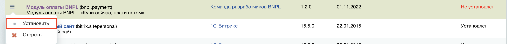
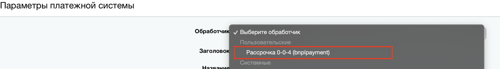
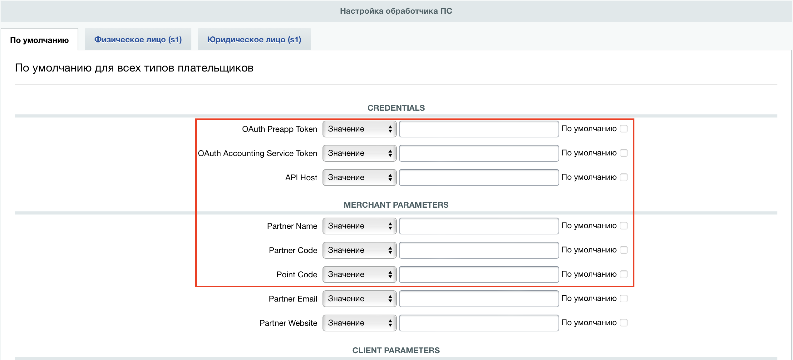

# Модуль оплаты BNPL для CMS Bitrix

## Установка

* Скачайте архив [factoring004-bitrix](https://github.com/bnpl-kz/factoring004-bitrix/archive/refs/heads/pad.zip)
* Распакуйте архив
* Переместите содержимое директории factoring004-bitrix-pad в директорию bitrix/modules/bnpl.pad
* Авторизуйтесь в админ панели Bitrix
* Перейдите на страницу **Marketplace** -> **Установленные решения** (Адрес: /bitrix/admin/partner_modules.php)
* В таблице **"Доступные решения"** в выпадающем меню нажмите кнопку **Установить**


## Настройка
* Перейдите на страницу Магазин -> Платежные системы (Адрес: /bitrix/admin/sale_pay_system.php) и нажмите кнопку **Добавить платежную систему**
* На странице добавления платежной системы в списке **"Обработчик"** выберите значение - **Оплата после доставки (bnplpad)**

* На этой же странице в разделе **"Настройка обработчика ПС"** нажмите ссылку **"Показать все"** чтобы увидеть все настройки плагина
* Заполните поля **OAuth Login**, **OAuth Password**, **API Host**, **Partner Name**, **Partner Code**, **Point Code**

* Нажмите кнопку **"Сохранить"**

## Корректировки
* Для совместной корректной работы плагинов **"Рассрочка 0-0-4 (bnplpayment)"** и **"Оплата после доставки (bnplpad)"** необходимо в исходном коде плагина **"Рассрочка 0-0-4 (bnplpayment)"** сделать несколько изменений:
* В файле `/bitrix/modules/bnpl.payment/template/set_values_default.php` удалить часть кода:
```javascript
else {
   document.querySelector("[name='CODE']").readOnly = false
   document.querySelector("[name='CODE']").value = ''
   description.body.innerText = '';
}
```
* В файле `/bitrix/modules/bnpl.payment/template/clear_cache_button.php` изменить начало кода:

начало кода до:
```php
<?php
   \Bitrix\Main\UI\Extension::load("ui.notification");
?>
```

после:
```php
<?php
use Bitrix\Sale\PaySystem\Manager;


\Bitrix\Main\UI\Extension::load("ui.notification");


$paySystemId = isset($_REQUEST['ID']) ? (int)$_REQUEST['ID'] : 0;
if (!$paySystemId) {
   return;
}


$paySystem = Manager::getById($paySystemId);
if (!$paySystem || empty($paySystem['ACTION_FILE']) || $paySystem['ACTION_FILE'] !== 'bnplpayment') {
   return;
}
?>
```
Последующие строки кода ниже оставляем без изменений

Модуль настроен и готов к работе